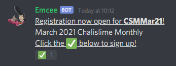

# Commands for participants

[Back to main](https://github.com/DawnbrandBots/emcee-tournament-bot#project-ignis-emcee)

## Table of contents
1. [Help](#help)
1. [Signing up for a tournament](#signing-up-for-a-tournament)
1. [During a tournament](#during-a-tournament)
1. [Submitting scores](#submitting-scores)
1. [Dropping](#dropping)

## Reference

### Help

Explicitly ping Emcee (not Discord replies) or send `mc!help` in a channel with Emcee
or direct messages with Emcee to get a link back here to Emcee documentation.

This also shows what revision of Emcee's code is currently running, which is more
useful for developer diagnostics.

### Signing up for a tournament

When a tournament host opens a tournament hosted through Emcee for registration, Emcee will
post a sign-up message to a designated announcement channel on the server for the tournament.
This message will have a ✅ reaction and clicking on it will begin the sign-up process.



Make sure you allow direct messages from Emcee! After reacting with ✅, you will receive a
direct message from Emcee instructing you to submit a deck. You can submit either a YDK deck file
by uploading it to Discord in the conversation, or reply with a `ydke://` URL.

Emcee will respond with your deck profile and any problems that make your deck illegal for
the tournament. If your deck is illegal, Emcee will instruct you to resubmit a legal deck.
If your deck is legal, you will be registered for the tournament and receive a participant
role for the tournament on the server. Your deck will be forwarded to the tournament hosts.

If you want to change your deck at any time before the tournament starts, you can submit
again to Emcee and the above process will be repeated. If you accidentally submit an
illegal deck this way, you will not be unregistered, though the deck will not be updated.

If you change your mind about playing, you can uncheck the ✅ reaction to drop from the tournament.
If the tournament starts, but you have yet to submit a deck, Emcee will inform you that you have been dropped.

### During a tournament

The tournament host decides when each round of a tournament begins. When a round begins, you will
be pinged from the same channel you signed up from with a link to the bracket on Challonge.
If the hosts choose to do so, Emcee will try to direct message you and your opponent about
your pairing, but it's up to you to contact your opponent and play your match within the round's
time limit, if any.

If there is a round time limit for this tournament, Emcee will also post it to the same channel
and count down every 5 seconds. All participants will be pinged when the time limit is reached.

When the tournament begins, Emcee will also post a guide for the exact commands below that
you should use during the tournament to report your scores or drop. You can send these
commands in a server channel or in direct messages with Emcee.

### Submitting scores
```
mc!score id|score
```
Replace _id_ and _score_ with the appropriate parameters below.

_id_ should be the Challonge ID for the tournament as reported by Emcee.
This is NOT the name of the tournament.

_score_ should be the score in your favour. Ties are accepted in Swiss.
For example, if the score for the match was `2-1` in your favour, you should
report a `2-1` and your opponent should report a `1-2`.

Each round, after the match is over, both you and your opponent need to use
this command to submit your scores to tournament hosts and Challonge.
If your scores disagree, both of you will need to resubmit.

You can copy and paste the exact command for your tournament from the **Report scores**
guide that Emcee posts in the announcement channel when the tournament begins.

### Dropping
```
mc!drop id
```
_id_ should be the Challonge ID for the tournament as reported by Emcee.
This is NOT the name of the tournament.

Use this if you want to stop playing.
If you're in the middle of a round, this will concede the current match.
Be careful, this **removes you from the tournament permanently.**

---

[Back to main](https://github.com/DawnbrandBots/emcee-tournament-bot#project-ignis-emcee)
